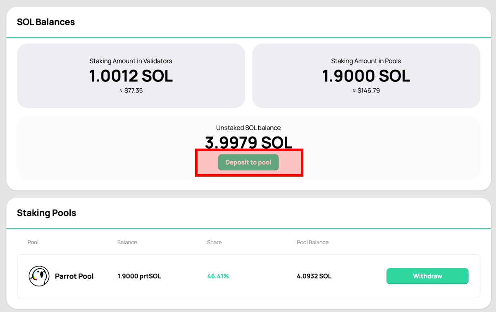
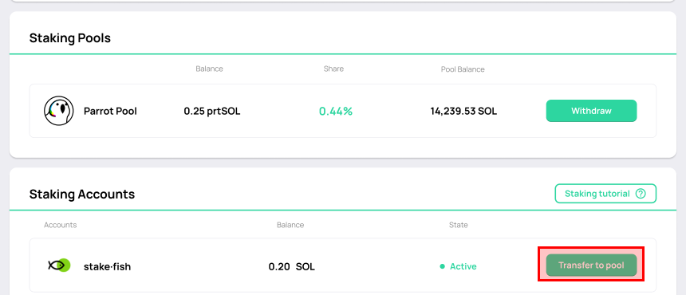
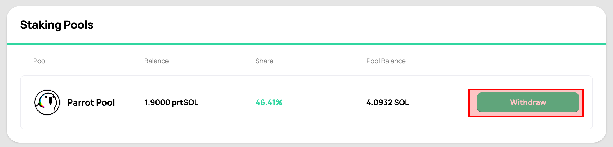
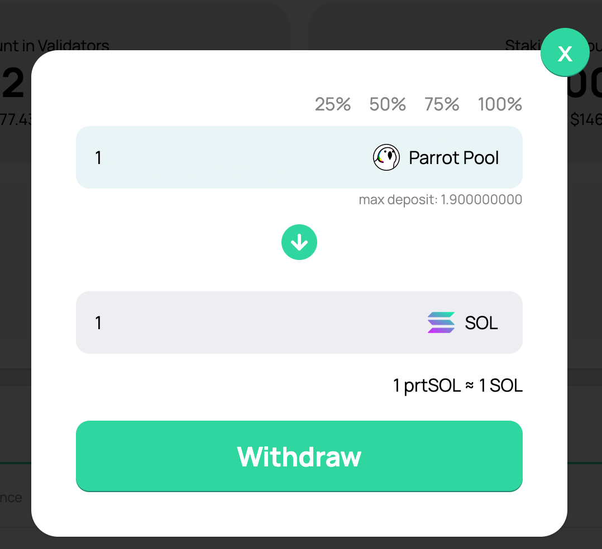
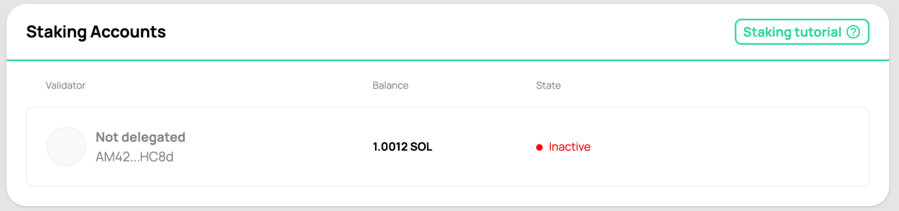

# Stake Pool

The Parrot Stake Pool is a deployment of the official [Solana Stake Pool](https://spl.solana.com/stake-pool) implementation. You can use the Parrot [stake pool UI](https://parrot.fi/stake-sol/) to stake SOL, and mint stake pool tokens.

This tutorial will guide you through the process of staking and unstaking with a stake pool. In a nutshell:

- You deposit SOL into the Parrot Stake Pool to receive prtSOL immediately
- The stake pool manager will be responsible for delegating the deposited SOL to validators
- You may withdraw from the stake pool at any time. Typically, you will end up with an activated stake account
- Undelegate from the activated account, and wait for the next epoch to get your SOL back
- You will receive the original amount of SOL plus the block rewards that have accrued

## Why Stake Pool?

The stake pool is an important new primitive for the Solana ecosystem because it solves a few important problems:

- It is difficult for a user to decide which validator to stake with. Which
  validators are stable? Which validators can help increase the security factor
  of the network?
- Once a staker has chosen a validator, the staked amount is too "sticky", as
  there is no incentive to balance the stake across more validators.
- A user faces the dilemma of whether to stake SOL or to use SOL. Using SOL in
  DeFi means missing out on about 6~7% of annual yield from block rewards.

The stake pool solves the first two problem because it is able to aggregate the
stakes of many users and delegate their SOL to multiple validators in ways
that helps to improve the security of the Solana network. For a pool staker, it is
"stake and forget", as the pool would also be responsible for rebalancing the
stake amounts to validators as needed.

More importantly, the stake pool issues a "stake pool token" to represent
your stake in the pool.

## Deposit SOL

You can deposit SOL into the Parrot Stake Pool to receive prtSOL immediately.

Click on "Deposit to pool":

Enter the amount of SOL you want to deposit:

prtSOL will increase in value as block rewards accrue in the stake
pool. Therefore, as time passes you will receive slightly less prtSOL for the same amount of SOL that you deposit. When
redeeming prtSOL for SOL, you will get your deposited SOL back plus the block
rewards that have accrued.

> Note: There are no fees for depositing, but there is a 0.1% withdrawl fee. 0.1% is roughly
> equal to 1 epoch worth of rewards, or about 3 days. The withdrawal fee protects
> the pool from users that stake SOL and immediately withdraw the SOL from the
> pool into an activated stake account.

## Deposit Staked SOL

Another way to join the pool is to use the SOL you've already staked with
another validator. You can join a stake pool with an activated stake account and immediately receive prtSOL. Right now the [Top 30 validators](./top30-validators.html) are supported.

> Note: your stake account needs to be activated, and then wait for at 1 additional epoch before it could join the pool. This is a technical quirk that will be fixed in an upcoming Solana release [PR #18985](https://github.com/solana-labs/solana/pull/18985).

Under "Staking Accounts", activated stake accounts that are supported would have the "Transfer to pool" button enabled:

## Withdraw SOL

You can redeem SOL from a stake pool token (i.e. prtSOL) at anytime.

First, select the stake pool that you want to exit from and click "Withdraw":

Enter the amount of prtSOL you want to redeem back to SOL:

After redemption, you don't get the SOL yet. Instead, you get a "stake account". Here, you can see that there is the 1 SOL from the redemption, plus 0.0012 paying for the rent of the stake account:

The stake account is what you'd have if you staked SOL directly with a validator, instead of through a stake pool. You'll need to undelegate to get the staked SOL back.

## Undelegate SOL

You can manage your stake accounts from Phantom, Solflare, or [Steaking.io](https://dashboard.steaking.io/stake). We recommend using steaking.io for its user-friendly UI.

Find the stake account you want to undelegate:

At the end of the current epoch, you'll receive the undelegated SOL in your wallet.
