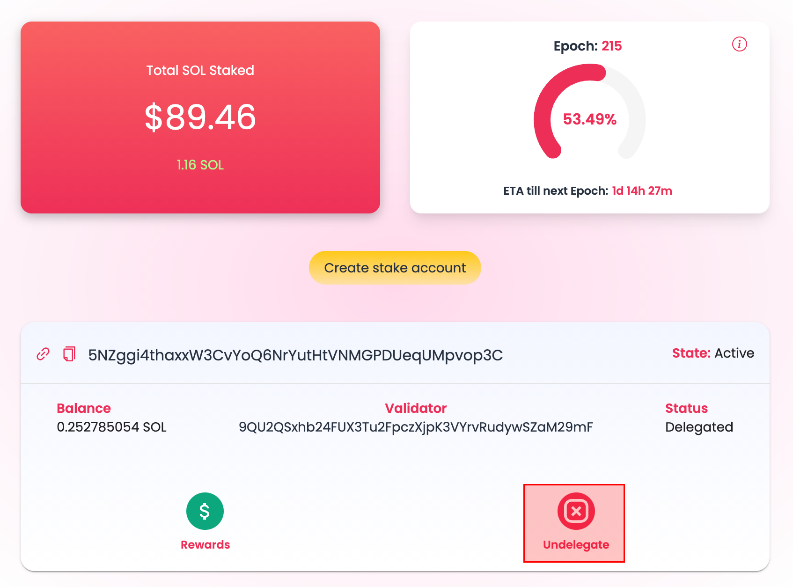

# Stake Pool

The Parrot Stake Pool is a deployment of the official [Solana Stake Pool](https://spl.solana.com/stake-pool) implementation. It uses the [SPL stake pool](https://github.com/solana-labs/solana-program-library/tree/4b0f59e9c61554708de969b01892b90955d5fd69/stake-pool).

This tutorial will guide you through the process of staking and unstaking with a stake pool. In a nutshell:

* You deposit SOL into the Parrot Stake Pool to receive prtSOL immediately
* The stake pool manager will be responsible for delegating the deposited SOL to validators
* At anytime, you may withdraw from the Stake Pool. Typically you'd end up with an activated stake account
* Undelegate from the activated account, and wait for the next epoch to get the SOL back
* You'd receive the original amount of SOL, plus the block rewards that have accrued

## Why Stake Pool?

The stake pool is an important new primitive for the Solana ecosystem, because it solves a few important problems:

* It is difficult for a user to know which validator to stake with. Which
  validators are stable? Which validators can help increase the security factor
  of the network?
* Once a staker had chosen a validator, the staked amount is too "sticky", as
  there is no incentive to balance the stakes across more validators.
* A user faces the dilemma of whether to stake SOL, or to use SOL. Using SOL in
  DeFi would cost the user about 6~7% of annual yield.

The stake pool solves the first two problem because it is able to aggregate the
stakes of many users, and delegate those SOL to multiple validators in ways
that helps to improve the Solana network security. For a pool staker, it is
"stake and forget", as the pool would also be responsible for rebalancing the
stake amounts to validators as necessary.

More importantly, the stake pool issues a "stake pool token" to represent
your stake in the pool.

## Deposit SOL

You can deposit SOL into the Parrot Stake Pool to receive prtSOL immediately.

Click on "Deposit to pool":

Enter the amount of SOL from you'd like to deposit:

prtSOL would increase in value as more block rewards have accrued in the stake
pool. You might get slightly less prtSOL for the amount SOL you put in. When
redeeming prtSOL for SOL, you'd get your deposited SOL back, plus SOL block
rewards.

Note: There is no fees for deposit, but a 0.1% withdrawl fee. 0.1% is roughly
equal to 1 epoch worth of rewards, or about 3 days. The withdrawal fee protects
the pool from users that stake SOL, and immediately withdraw the SOL from the
pool into an activated stake account.

## Deposit Staked SOL

Another way to join the pool is to use the SOL you've already staked with
another validator. You can join a stake pool, immediately get prtSOL, without
having to wait for at least 2 epochs to unstake, restake.

(TODO. Launching soon.)

## Withdraw SOL

You can redeem SOL from a stake pool token (i.e. prtSOL) at anytime.

First select the stake pool that you want to exit from, and click "withdraw":

Enter the amount of prtSOL you want to redeem back to SOL:

After redemption, you don't get the SOL yet. Instead, you get a "stake account". Here you can see that there is the 1 SOL from the redemption, plus 0.0012 paying for the rent of the stake account:

The stake account is what you'd have if you staked SOL directly with a validator, instead of through a stake pool. You'll need to undelegate to get the staked SOL back.

## Undelegate SOL

You can manage your stake accounts from Phantom, Solflare, or [Steaking.io](https://dashboard.steaking.io/stake). We recommend using steaking.io for its user friendly UI.

Find the stake account you want to undelegate:

At the end of the current epoch, you'll get the undelegated SOL back to your wallet.