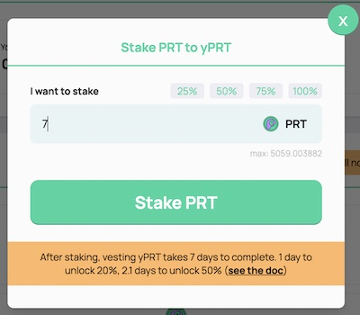

# yPRT

yPRT is the Parrot Yield Token. Holding yPRT entitles you to protocol incentives and value accrual, compounding your yPRT holdings.

- Staking PRT, to convert PRT into yPRT
- Vesting yPRT, to unlock yPRT back to PRT

Vesting yPRT takes 7 days to complete. In the first day you will get 20% unlocked, and in the 2.1 day you will get 50% unlocked.

# Staking PRT

Visit [https://parrot.fi/yprt](https://parrot.fi/yprt).

Click on "Stake" to stake PRT and get yPRT:

Choose the amount of PRT you'd like to stake:

Staking 1000 PRT tokens will get you 1000 yPRT tokens. Your PRT will be locked, and requires a vesting process to convert back to PRT.

By holding yPRT, you will receive protocol incentives.

The yPRT token's mint address is yPRTUpLDftNej7p6QofNYgRArRXsm6Mvkzohj4bh4WM.

# Vest yPRT

Visit https://parrot.fi/yprt.

Click on "Vest yPRT" to convert yPRT to PRT:

Enter the amount that you'd like to vest:

After vesting, you should see that your yPRT amount is decreasing every second:

You can claim the vested PRT by clicking the "Claim PRT" button:

At any time you may add or remove the amount of yPRT you are vesting.

By the end of 2.1 days, 50% will be unlocked. Theoretically this goes on forever, but at the end of 7 days the vesting vault will allow you to claim all the remaining PRT tokens.

However, the vesting yPRT tokens would no longer receive protocol incentives. If you'd like to stop vesting, you may click on "Unvest yPRT" at any time.
